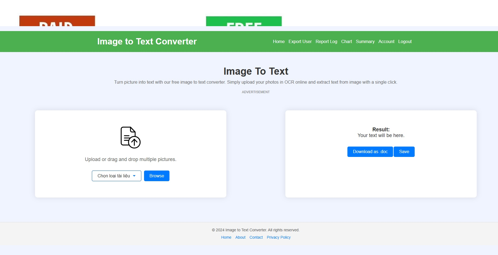

# AI_OCR 

### 1. Cài đặt thư viện Node.js
```bash
npm install
````

### 2. Cài đặt các thư viện Python trong requirements.txt


### 3. Tải file `.pth` từ Google Drive

[Link tải file `.pth`](https://drive.google.com/file/d/1bqW5GywnoWtlqlft_t4MVzk_Pxh1eZxT/view?usp=sharing)

Sau khi tải, hãy đặt nó vào thư mục:

```bash
Model/data/
```

### 4. Chạy ứng dụng

```bash
python main.py
```

````

---

## 📌 Lưu ý quan trọng:
- Model được train tập trung để convert các loại giấy tờ như giấy phép lái xe, căng cước, ......
- Có thể kích hoạt chạy 2 luồng để vừa convert ảnh vừa trainning tuy nhiên sẽ nặng máy. ( tại method start_app của view và enable trainning thread )



